# 🔍 ES Lite Manager

[**中文**](#中文) | [**English**](#english)

## 📋 目录 / Table of Contents

### 中文
- [✨ 功能特性](#-功能特性)
  - [🔍 高级搜索界面](#-高级搜索界面)
  - [📚 索引管理](#-索引管理)
  - [📝 文档管理](#-文档管理)
  - [📊 统计仪表板](#-统计仪表板)
  - [🎯 策略管理](#-策略管理)
  - [🔤 分析器工具包](#-分析器工具包)
  - [🗂️ 映射管理](#️-映射管理)
  - [🔌 插件管理](#-插件管理)
  - [🌐 连接管理](#-连接管理)
  - [🎨 现代用户体验](#-现代用户体验)
- [🚀 快速开始](#-快速开始)
  - [📦 安装配置](#-安装配置)
  - [⚙️ 重要配置说明](#️-重要配置说明)
  - [⚡ 开发运行](#-开发运行)
  - [🐳 Docker 部署](#-docker-部署)
- [📁 项目结构](#-项目结构)
- [⚙️ 配置说明](#️-配置说明)
- [🛡️ 安全特性](#️-安全特性)
- [📊 监控和分析](#-监控和分析)
- [🤝 贡献指南](#-贡献指南)
- [📈 发展路线图](#-发展路线图)
- [📄 开源协议](#-开源协议)
- [🙏 致谢](#-致谢)
- [📞 支持](#-支持)

### English
- [✨ Key Features](#-key-features)
  - [🔍 Advanced Search Interface](#-advanced-search-interface)
  - [📚 Index Management](#-index-management)
  - [📝 Document Management](#-document-management)
  - [📊 Statistics Dashboard](#-statistics-dashboard)
  - [🎯 Strategy Management](#-strategy-management)
  - [🔤 Analyzer Toolkit](#-analyzer-toolkit)
  - [🗂️ Mapping Management](#️-mapping-management)
  - [🔌 Plugin Management](#-plugin-management)
  - [🌐 Connection Management](#-connection-management)
  - [🎨 Modern User Experience](#-modern-user-experience)
- [🚀 Quick Start](#-quick-start)
  - [🐳 Docker (Recommended)](#-docker-recommended)
  - [📦 Manual Installation](#-manual-installation)
  - [⚙️ Detailed Setup (Optional)](#️-detailed-setup-optional)
  - [⚡ Development](#-development)
  - [🐳 Docker Deployment](#-docker-deployment)
- [🏗️ Architecture](#️-architecture)
- [📄 License](#-license)

---

## 中文

> 现代化、直观的 Elasticsearch 集群管理平台

### ✨ 功能特性

#### 🔍 高级搜索界面
强大的搜索功能，支持多种查询类型和实时结果展示。

<div align="center">
  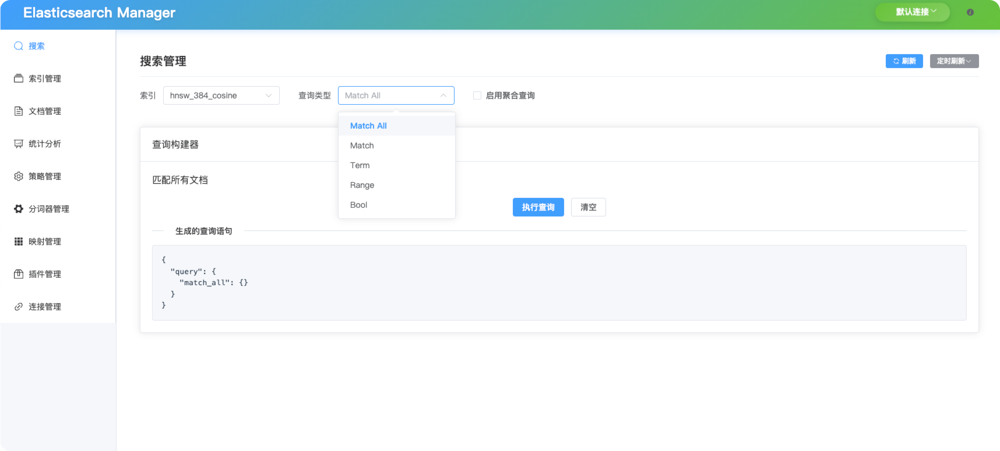
</div>

- **多查询支持**: Match、term、range、bool、wildcard 和 fuzzy 查询
- **实时结果**: 即时搜索结果，支持语法高亮
- **查询构建器**: 可视化查询构造器，提供预览功能
- **高级过滤**: 复杂的过滤和排序选项

#### 📚 索引管理
完整的 Elasticsearch 索引生命周期管理，包含详细监控。

<div align="center">
  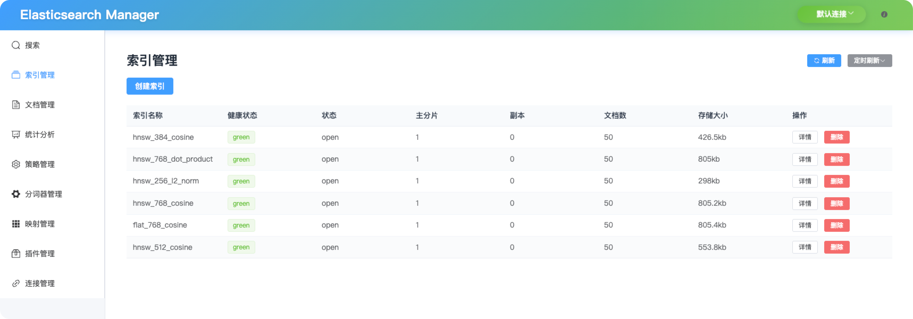
</div>

<div align="center">
  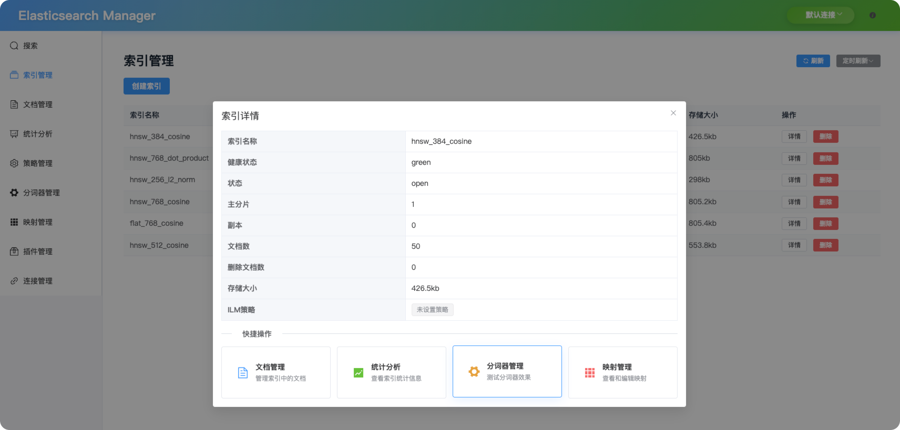
</div>

- **索引生命周期**: 创建、配置、监控和删除索引
- **健康监控**: 实时索引健康和性能指标
- **设置管理**: 配置索引设置和映射
- **批量操作**: 对多个索引执行批量操作

#### 📝 文档管理
全面的文档 CRUD 操作，支持批量处理功能。

<div align="center">
  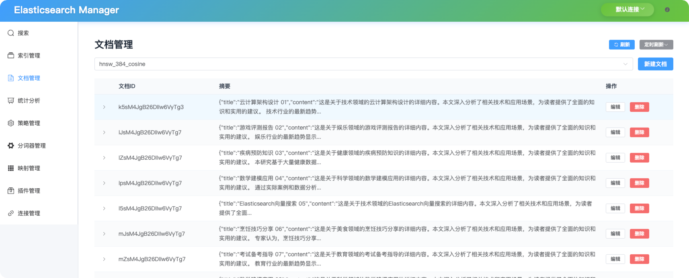
</div>

<div align="center">
  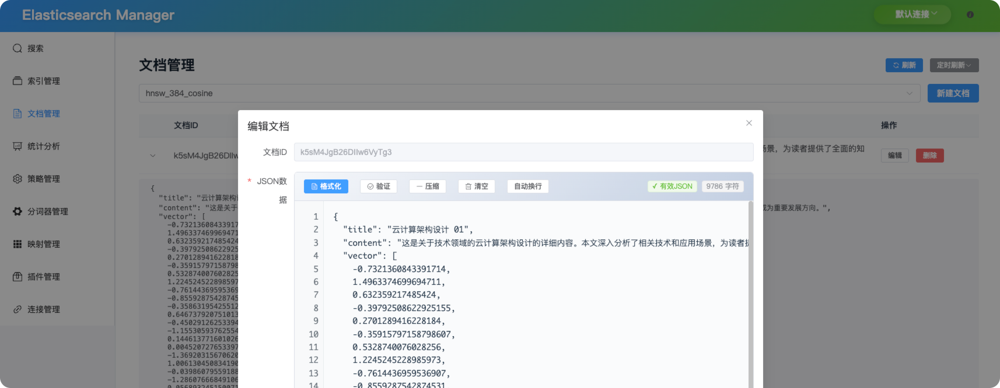
</div>

- **文档 CRUD**: 创建、读取、更新和删除文档
- **批量操作**: 高效处理多个文档
- **JSON 编辑器**: 语法高亮的 JSON 编辑器，支持验证
- **搜索集成**: 在索引内搜索和过滤文档

#### 📊 统计仪表板
集群健康状况、性能指标和使用分析的丰富可视化。

<div align="center">
  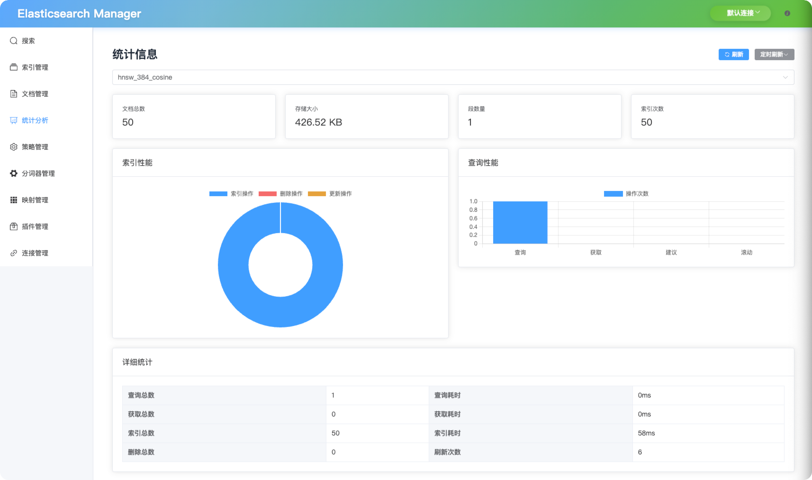
</div>

- **集群健康**: 实时集群状态和节点信息
- **性能指标**: 响应时间、吞吐量和错误率
- **使用分析**: 索引使用模式和存储统计
- **交互式图表**: 动态图表，支持钻取功能

#### 🎯 策略管理
配置和监控索引生命周期管理（ILM）策略。

<div align="center">
  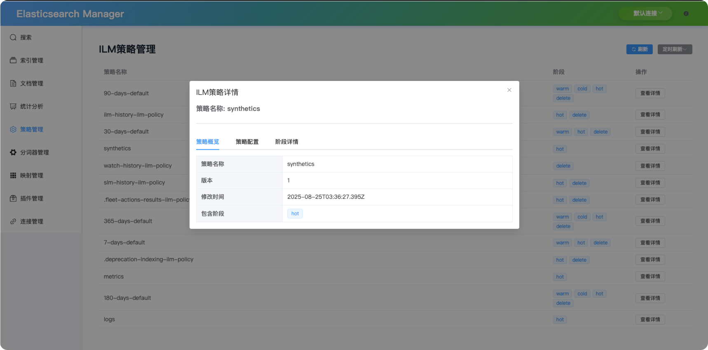
</div>

- **ILM 策略**: 创建和管理索引生命周期策略
- **策略配置**: 定义热、温、冷存储阶段
- **自动化规则**: 设置自动索引管理规则
- **策略监控**: 跟踪策略执行和合规性

#### 🔤 分析器工具包
测试和调试内置及自定义文本分析器。

<div align="center">
  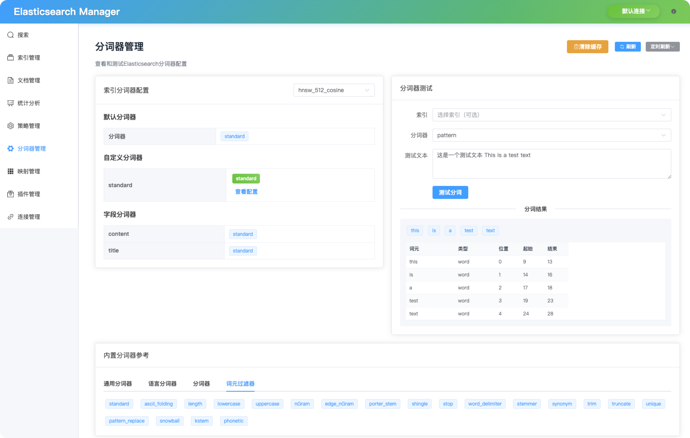
</div>

- **分析器测试**: 使用不同分析器测试文本分析
- **分词可视化**: 实时查看分词结果
- **自定义分析器**: 创建和测试自定义分析器配置
- **调试工具**: 使用详细输出排查分析问题

#### 🗂️ 映射管理
交互式映射编辑器，支持字段类型验证。

<div align="center">
  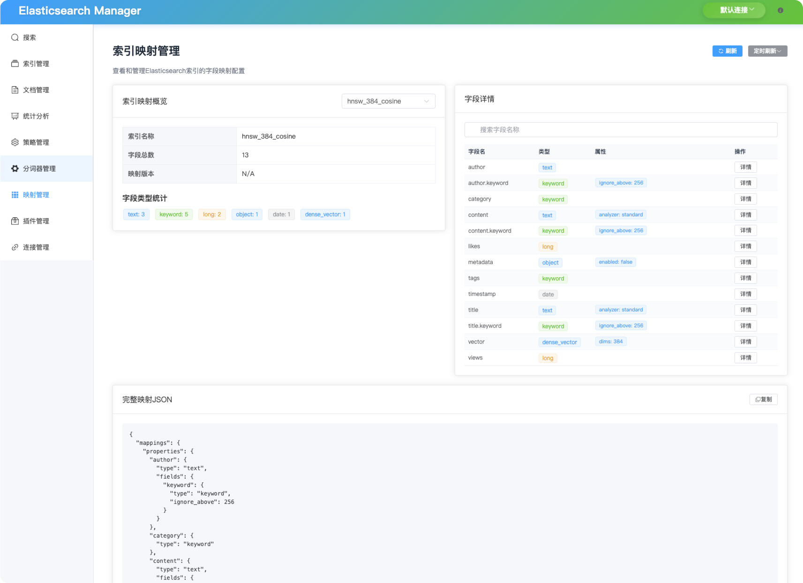
</div>

- **模式编辑器**: 可视化映射编辑器，支持字段类型验证
- **字段管理**: 添加、修改和删除映射字段
- **类型验证**: 字段类型和设置的自动验证
- **映射预览**: 应用前预览映射更改

#### 🔌 插件管理
管理和监控 Elasticsearch 插件。

<div align="center">
  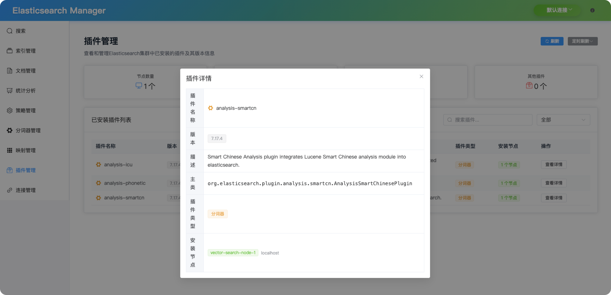
</div>

- **插件发现**: 列出已安装和可用插件
- **安装管理**: 安装和卸载插件
- **插件信息**: 查看详细的插件信息和依赖关系
- **健康监控**: 监控插件状态和性能

#### 🌐 连接管理
无缝管理多个 Elasticsearch 集群，支持安全凭据存储。

<div align="center">
  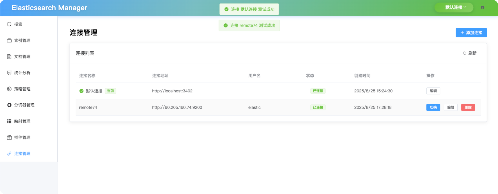
</div>

- **多集群支持**: 管理多个 Elasticsearch 集群
- **动态连接**: 添加、编辑和删除集群连接
- **安全存储**: 使用 base64 编码的加密凭据管理
- **连接测试**: 保存前测试连接
- **快速切换**: 导航栏中一键切换集群

#### 🎨 现代用户体验
- **响应式设计**: 针对桌面、平板和移动设备优化
- **深色/浅色主题**: 基于系统偏好的自动主题切换
- **实时更新**: WebSocket 连接的实时数据同步
- **JSON 美化**: 语法高亮和可折叠的 JSON 查看器
- **键盘快捷键**: 常用操作的用户快捷键

### 🚀 快速开始

#### 环境要求
- **Node.js** >= 16.0.0
- **npm** >= 7.0.0
- **Elasticsearch** >= 7.0.0

#### 📦 安装配置

```bash
# 克隆仓库
git clone https://github.com/username/es-lite-manager.git
cd es-lite-manager

# 安装依赖
npm install

# 配置环境
cp .env.example .env
cp server/.env.example server/.env
```

#### ⚙️ 重要配置说明

**关键提醒**: 启动前必须正确配置环境文件，特别注意端口配置的一致性。

##### 前端配置 (`.env`)
```bash
# API 配置 - ⚠️ 重要：必须与后端端口一致
API_BASE_URL=http://localhost:9022

# 前端服务端口
FRONTEND_PORT=3420

# Elasticsearch 连接配置（仅作参考）
ES_HOST=localhost
ES_PORT=9200
ES_USERNAME=elastic
ES_PASSWORD=your_actual_password  # 请替换为实际密码
```

##### 后端配置 (`server/.env`)
```bash
# 服务器端口 - ⚠️ 重要：使用 PORT 而不是 SERVER_PORT
PORT=9022

# Elasticsearch 连接
ES_NODE=http://localhost:9200
ES_USERNAME=elastic
ES_PASSWORD=your_actual_password  # 请替换为实际密码

# 连接参数
ES_REQUEST_TIMEOUT=30000
ES_PING_TIMEOUT=3000
ES_MAX_RETRIES=3
```

##### Vite 代理配置检查
确保 `vite.config.js` 中的代理目标正确：
```javascript
proxy: {
  '/api': {
    target: 'http://localhost:9022',  // 必须与后端 PORT 一致
    changeOrigin: true,
    rewrite: (path) => path.replace(/^\/api/, '')
  }
}
```

#### ⚡ 开发运行

```bash
# 步骤1：启动后端服务（终端1）
npm run server
# 预期输出：ES Manager Server running at http://0.0.0.0:9022

# 步骤2：启动前端开发服务（终端2）
npm run dev
# 预期输出：➜  Local:   http://localhost:3420/

# 步骤3：在浏览器中访问应用
# 前端地址：http://localhost:3420
# 后端 API：http://localhost:9022
```

##### ✅ 部署验证步骤
```bash
# 检查后端健康状态
curl http://localhost:9022/health
# 预期输出：{"connected":false,"error":""}

# 检查前端页面加载
curl -s http://localhost:3420/ | head -5
# 预期输出：HTML 内容
```

##### 🔧 常见问题解决

**端口占用错误**
```bash
# 如果看到：Error: listen EADDRINUSE :::3420 或 :::9022
# 查找并终止占用端口的进程
lsof -i :3420
lsof -i :9022
kill -9 <进程ID>
```

**后端运行在错误端口**
```bash
# 如果后端显示运行在端口 3000 而不是 9022
# 编辑 server/.env 确保使用：
PORT=9022  # 不是 SERVER_PORT=9022
```

**前端无法连接后端**
```bash
# 检查以下文件中的端口配置是否一致：
# .env: API_BASE_URL=http://localhost:9022
# vite.config.js: target: 'http://localhost:9022'
# server/.env: PORT=9022
```

**Elasticsearch 连接问题**
- 应用可以在没有 Elasticsearch 的情况下正常启动
- 使用"连接管理"页面配置 ES 集群连接
- 或启动测试 ES 实例：
```bash
docker run -d --name elasticsearch-test \
  -p 9200:9200 \
  -e "discovery.type=single-node" \
  -e "xpack.security.enabled=false" \
  elasticsearch:8.10.0
```

##### 🚀 一键启动脚本
创建 `quick-start.sh` 脚本快速部署：
```bash
#!/bin/bash
echo "🚀 ES Lite Manager 快速部署"

npm install

[ ! -f ".env" ] && cp .env.example .env && echo "✅ 前端配置已创建"
[ ! -f "server/.env" ] && cp server/.env.example server/.env && echo "✅ 后端配置已创建"

echo "🌟 启动后端服务..."
npm run server &

echo "🎨 启动前端服务..."
npm run dev &

echo "🎉 部署完成！"
echo "📱 前端：http://localhost:3420"
echo "🔧 后端：http://localhost:9022"
echo "按 Ctrl+C 停止服务"
wait
```

使用方法：`chmod +x quick-start.sh && ./quick-start.sh`

#### 🐳 Docker 部署

##### 方式一：从 Docker Hub 拉取（推荐）

```bash
# 拉取并运行最新镜像
docker run -d \
  -p 8080:80 \
  -p 9021:9021 \
  --name es-manager-app \
  19963666/es_lite_manager:latest

# 访问应用
# 前端界面: http://localhost:8080
# 后端 API: http://localhost:9021
```

##### 方式二：本地构建运行

```bash
# 构建 Docker 镜像
docker build -t es-manager:latest .

# 运行容器
docker run -d \
  -p 8080:80 \
  -p 9021:9021 \
  --name es-manager-app \
  es-manager:latest
```

##### 方式三：使用 Docker Compose

```bash
# 使用 Docker Compose（包含所有服务）
docker-compose up -d
```

##### 配置 Elasticsearch 连接

容器默认连接到 `http://host.docker.internal:3402`。如需连接不同的 Elasticsearch 实例：

```bash
# 使用自定义 ES 配置运行
docker run -d \
  -p 8080:80 \
  -p 9021:9021 \
  -e ES_HOST=your-es-server.com \
  -e ES_PORT=9200 \
  -e ES_USERNAME=elastic \
  -e ES_PASSWORD=your_password \
  --name es-manager-app \
  19963666/es_lite_manager:latest
```

##### 容器管理

```bash
# 查看日志
docker logs es-manager-app

# 停止容器
docker stop es-manager-app

# 删除容器
docker rm es-manager-app

# 更新到最新版本
docker pull 19963666/es_lite_manager:latest
docker stop es-manager-app && docker rm es-manager-app
docker run -d -p 8080:80 -p 9021:9021 --name es-manager-app 19963666/es_lite_manager:latest
```

**📖 详细的 Docker 部署说明请参考: [Docker 构建与部署指南](./DOCKER_BUILD_GUIDE.md)**

### 📁 项目结构

```
es-lite-manager/
├── 🎨 src/                      # 前端应用
│   ├── 📡 api/                  # API 客户端和服务
│   ├── 🧩 components/           # 可复用 Vue 组件
│   │   ├── JsonViewer.vue       # 语法高亮 JSON 显示
│   │   ├── JsonEditor.vue       # 交互式 JSON 编辑器
│   │   └── RefreshTimer.vue     # 自动刷新功能
│   ├── 📄 views/                # 页面组件
│   │   ├── 🔍 Search.vue        # 高级搜索界面
│   │   ├── 📚 Indices.vue       # 索引管理
│   │   ├── 📝 Documents.vue     # 文档 CRUD 操作
│   │   ├── 📊 Stats.vue         # 分析仪表板
│   │   ├── 🔌 Connections.vue   # 连接管理
│   │   ├── 📋 Policies.vue      # ILM 策略管理
│   │   ├── 🔤 Analyzers.vue     # 文本分析器测试
│   │   └── 🗂️ Mappings.vue      # 模式管理
│   ├── 🧭 router/               # Vue Router 配置
│   └── 🛠️ utils/                # 帮助函数和工具
├── ⚙️ server/                   # 后端 API 服务
│   ├── config.js               # 配置管理
│   ├── connectionManager.js    # 多集群连接处理程序
│   └── index.js               # Express 服务器和 API 路由
├── 🐳 docker-compose.yml       # 容器编排
└── 📋 .env.example             # 环境变量模板
```

### ⚙️ 配置说明

#### 环境变量配置

从模板创建 `.env` 和 `server/.env`：

```bash
# 前端配置 (.env)
VITE_API_BASE_URL=http://localhost:3002
VITE_APP_TITLE=ES Lite Manager

# 后端配置 (server/.env)
ES_NODE=http://localhost:9200
ES_USERNAME=elastic  
ES_PASSWORD=your_secure_password
SERVER_PORT=3002
CORS_ORIGIN=http://localhost:3420
```

#### 多集群设置

1. 在侧边栏导航到 **连接管理**
2. 点击 **添加新连接**
3. 配置集群详细信息：
   - **名称**: 友好的集群名称
   - **主机**: Elasticsearch 主机地址
   - **端口**: 通常为 9200 或云端 9243
   - **协议**: HTTP 或 HTTPS
   - **认证**: 用户名/密码或 API 密钥
4. 保存前 **测试连接**
5. 使用顶部导航中的集群选择器切换上下文

### 🛡️ 安全特性

- **凭据加密**: 使用 base64 编码在静态状态下加密密码
- **连接验证**: 自动 SSL 证书验证
- **CORS 保护**: 可配置的来源限制
- **输入清理**: 所有用户输入的 XSS 防护
- **速率限制**: API 端点防滥用保护
- **审计日志**: 跟踪所有管理操作

### 📊 监控和分析

#### 内置仪表板
- **集群健康状况**: 节点状态、磁盘使用率、内存利用率
- **索引统计**: 文档计数、存储大小、搜索性能
- **查询性能**: 响应时间、查询模式、错误率
- **实时指标**: 实时更新的图表和仪表

### 🤝 贡献指南

欢迎贡献！请查看我们的[贡献指南](CONTRIBUTING.md)了解详情。

#### 开发工作流程
1. **Fork** 仓库
2. **创建** 功能分支: `git checkout -b feature/amazing-feature`
3. **提交** 你的更改: `git commit -m 'feat: add amazing feature'`
4. **推送** 到你的分支: `git push origin feature/amazing-feature`
5. **提交** Pull Request

#### 代码标准
- 遵循 [Vue 3 风格指南](https://v3.vuejs.org/style-guide/)
- 使用 [约定式提交](https://conventionalcommits.org/)
- 保持测试覆盖率 80% 以上
- 为新功能和 API 编写文档

### 📈 发展路线图

- [ ] **多租户** 支持 SaaS 部署
- [ ] **高级安全** RBAC 和 OAuth 集成
- [ ] **机器学习** 异常检测集成
- [ ] **自定义插件** 系统扩展性
- [ ] **移动应用** 集群监控移动端
- [ ] **企业功能** 备份管理和合规报告

### 📄 开源协议

本项目采用 MIT 协议 - 查看 [LICENSE](LICENSE) 文件了解详情。

### 🙏 致谢

使用以下优秀技术构建 ❤️：

- [**Elasticsearch**](https://www.elastic.co/) - 搜索和分析的核心
- [**Vue.js**](https://vuejs.org/) - 渐进式 JavaScript 框架
- [**Element Plus**](https://element-plus.org/) - 企业级 UI 组件
- [**Chart.js**](https://www.chartjs.org/) - 美观、响应式图表
- [**Express.js**](https://expressjs.com/) - 快速、极简的 web 框架

### 📞 支持

- 📫 **问题反馈**: [GitHub Issues](https://github.com/username/es-lite-manager/issues)
- 💬 **讨论**: [GitHub Discussions](https://github.com/username/es-lite-manager/discussions)
- 📧 **邮箱**: support@eslitemanager.com
- 📚 **文档**: [官方文档](https://docs.eslitemanager.com)

---

## English

> A modern, intuitive web-based management platform for Elasticsearch clusters

[](https://opensource.org/licenses/MIT)
[](https://nodejs.org/)
[](https://vuejs.org/)
[](https://www.elastic.co/)

<div align="center">
  
</div>

### ✨ Key Features

#### 🔍 Advanced Search Interface
Powerful search capabilities with multiple query types and real-time results.

<div align="center">
  
</div>

- **Multi-Query Support**: Match, term, range, bool, wildcard, and fuzzy queries
- **Real-time Results**: Instant search results with syntax highlighting
- **Query Builder**: Visual query constructor with preview functionality
- **Advanced Filters**: Complex filtering and sorting options

#### 📚 Index Management
Complete lifecycle management for Elasticsearch indices with detailed monitoring.

<div align="center">
  
</div>

<div align="center">
  
</div>

- **Index Lifecycle**: Create, configure, monitor, and delete indices
- **Health Monitoring**: Real-time index health and performance metrics
- **Settings Management**: Configure index settings and mappings
- **Bulk Operations**: Perform bulk operations on multiple indices

#### 📝 Document Management
Comprehensive document CRUD operations with bulk processing capabilities.

<div align="center">
  
</div>

<div align="center">
  
</div>

- **Document CRUD**: Create, read, update, and delete documents
- **Bulk Operations**: Process multiple documents efficiently
- **JSON Editor**: Syntax-highlighted JSON editor with validation
- **Search Integration**: Search and filter documents within indices

#### 📊 Statistics Dashboard
Rich visualizations for cluster health, performance metrics, and usage analytics.

<div align="center">
  
</div>

- **Cluster Health**: Real-time cluster status and node information
- **Performance Metrics**: Response times, throughput, and error rates
- **Usage Analytics**: Index usage patterns and storage statistics
- **Interactive Charts**: Dynamic charts with drill-down capabilities

#### 🎯 Strategy Management
Configure and monitor Index Lifecycle Management (ILM) policies.

<div align="center">
  
</div>

- **ILM Policies**: Create and manage index lifecycle policies
- **Policy Configuration**: Define hot, warm, and cold storage phases
- **Automation Rules**: Set up automatic index management rules
- **Policy Monitoring**: Track policy execution and compliance

#### 🔤 Analyzer Toolkit
Test and debug built-in and custom text analyzers.

<div align="center">
  
</div>

- **Analyzer Testing**: Test text analysis with different analyzers
- **Token Visualization**: View tokenization results in real-time
- **Custom Analyzers**: Create and test custom analyzer configurations
- **Debug Tools**: Troubleshoot analysis issues with detailed output

#### 🗂️ Mapping Management
Interactive mapping editor with field type validation.

<div align="center">
  
</div>

- **Schema Editor**: Visual mapping editor with field type validation
- **Field Management**: Add, modify, and delete mapping fields
- **Type Validation**: Automatic validation of field types and settings
- **Mapping Preview**: Preview mapping changes before applying

#### 🔌 Plugin Management
Manage and monitor Elasticsearch plugins.

<div align="center">
  
</div>

- **Plugin Discovery**: List installed and available plugins
- **Installation Management**: Install and uninstall plugins
- **Plugin Information**: View detailed plugin information and dependencies
- **Health Monitoring**: Monitor plugin status and performance

#### 🌐 Connection Management
Seamlessly manage multiple Elasticsearch clusters with secure credential storage.

<div align="center">
  
</div>

- **Multi-Cluster Support**: Manage multiple Elasticsearch clusters
- **Dynamic Connections**: Add, edit, and remove cluster connections
- **Secure Storage**: Encrypted credential management with base64 encoding
- **Connection Testing**: Test connections before saving
- **Quick Switch**: One-click cluster switching in the navigation bar

#### 🎨 Modern User Experience
- **Responsive Design**: Optimized for desktop, tablet, and mobile devices
- **Dark/Light Themes**: Automatic theme switching based on system preferences
- **Real-time Updates**: Live data synchronization with WebSocket connections
- **JSON Beautification**: Syntax highlighting and collapsible JSON viewer
- **Keyboard Shortcuts**: Power-user shortcuts for common operations

### 🚀 Quick Start

#### 🐳 Docker (Recommended)

```bash
# Pull and run - No configuration needed!
docker run -d \
  -p 8080:80 \
  -p 9021:9021 \
  --name es-manager-app \
  19963666/es_lite_manager:latest

# Access: http://localhost:8080
```

#### 📦 Manual Installation

Prerequisites: **Node.js** >= 16.0.0, **npm** >= 7.0.0

```bash
# Clone and install
git clone https://github.com/username/es-lite-manager.git
cd es-lite-manager
npm install

# Quick setup (uses defaults)
cp .env.example .env
cp server/.env.example server/.env

# Start services
npm run server &
npm run dev

# Access: http://localhost:3420
```

#### ⚙️ Detailed Setup (Optional)

<details>
<summary>Click to expand detailed configuration and troubleshooting</summary>

##### Configuration Files

**Important**: Before starting the application, you need to configure the environment files properly.

##### Frontend Configuration (`.env`)
```bash
# API Configuration - ⚠️ IMPORTANT: Must match backend port
API_BASE_URL=http://localhost:9022

# Frontend server port
FRONTEND_PORT=3420

# Elasticsearch connection (for reference only)
ES_HOST=localhost
ES_PORT=9200
ES_USERNAME=elastic
ES_PASSWORD=your_actual_password  # Replace with actual password
```

##### Backend Configuration (`server/.env`)
```bash
# Server port - ⚠️ IMPORTANT: Use PORT not SERVER_PORT  
PORT=9022

# Elasticsearch connection
ES_NODE=http://localhost:9200
ES_USERNAME=elastic
ES_PASSWORD=your_actual_password  # Replace with actual password

# Connection settings
ES_REQUEST_TIMEOUT=30000
ES_PING_TIMEOUT=3000
ES_MAX_RETRIES=3
```

##### Vite Proxy Configuration
Ensure `vite.config.js` has the correct proxy target:
```javascript
proxy: {
  '/api': {
    target: 'http://localhost:9022',  // Must match backend PORT
    changeOrigin: true,
    rewrite: (path) => path.replace(/^\/api/, '')
  }
}
```

#### ⚡ Development

```bash
# Step 1: Start backend server (Terminal 1)
npm run server
# Expected output: 
# ES Manager Server running at http://0.0.0.0:9022

# Step 2: Start frontend dev server (Terminal 2) 
npm run dev
# Expected output:
# ➜  Local:   http://localhost:3420/

# Step 3: Open browser and access the application
# Frontend: http://localhost:3420
# Backend API: http://localhost:9022
```

##### ✅ Verification Steps
```bash
# Check backend health
curl http://localhost:9022/health
# Expected: {"connected":false,"error":""}

# Check frontend loading
curl -s http://localhost:3420/ | head -5
# Expected: HTML content with Vite dev server
```

##### 🔧 Common Issues & Solutions

**Port Conflict Error**
```bash
# If you see: Error: listen EADDRINUSE :::3420 or :::9022
# Find and kill the process using the port
lsof -i :3420
lsof -i :9022
kill -9 <PID>
```

**Backend Running on Wrong Port**
```bash
# If backend shows port 3000 instead of 9022
# Edit server/.env and ensure:
PORT=9022  # Not SERVER_PORT=9022
```

**Frontend Can't Connect to Backend**
```bash
# Check these files match:
# .env: API_BASE_URL=http://localhost:9022
# vite.config.js: target: 'http://localhost:9022'
# server/.env: PORT=9022
```

**Elasticsearch Connection Issues**
- The app will start successfully even without Elasticsearch
- Use the "Connection Management" page to configure ES clusters
- Or start a test ES instance:
```bash
docker run -d --name elasticsearch-test \
  -p 9200:9200 \
  -e "discovery.type=single-node" \
  -e "xpack.security.enabled=false" \
  elasticsearch:8.10.0
```

##### 🚀 Quick Start Script
Create a `quick-start.sh` file for easy deployment:
```bash
#!/bin/bash
echo "🚀 ES Lite Manager Quick Deployment"

# Install dependencies
npm install

# Setup environment files if they don't exist
[ ! -f ".env" ] && cp .env.example .env && echo "✅ Frontend config created"
[ ! -f "server/.env" ] && cp server/.env.example server/.env && echo "✅ Backend config created"

# Start services
echo "🌟 Starting backend server..."
npm run server &

echo "🎨 Starting frontend server..."
npm run dev &

echo "🎉 Deployment complete!"
echo "📱 Frontend: http://localhost:3420"
echo "🔧 Backend: http://localhost:9022"
echo "Press Ctrl+C to stop services"
wait
```

Usage: `chmod +x quick-start.sh && ./quick-start.sh`

#### 🐳 Docker Deployment

##### Option 1: Pull from Docker Hub (Recommended)

```bash
# Pull and run the latest image
docker run -d \
  -p 8080:80 \
  -p 9021:9021 \
  --name es-manager-app \
  19963666/es_lite_manager:latest

# Access the application
# Frontend: http://localhost:8080
# Backend API: http://localhost:9021
```

##### Option 2: Build locally and run

```bash
# Build Docker image
docker build -t es-manager:latest .

# Run container
docker run -d \
  -p 8080:80 \
  -p 9021:9021 \
  --name es-manager-app \
  es-manager:latest
```

##### Option 3: Using Docker Compose

```bash
# Using Docker Compose (includes all services)
docker-compose up -d
```

##### Configure Elasticsearch Connection

The container connects to `http://host.docker.internal:3402` by default. To connect to a different Elasticsearch instance:

```bash
# Run with custom ES configuration
docker run -d \
  -p 8080:80 \
  -p 9021:9021 \
  -e ES_HOST=your-es-server.com \
  -e ES_PORT=9200 \
  -e ES_USERNAME=elastic \
  -e ES_PASSWORD=your_password \
  --name es-manager-app \
  19963666/es_lite_manager:latest
```

##### Container Management

```bash
# View logs
docker logs es-manager-app

# Stop container
docker stop es-manager-app

# Remove container
docker rm es-manager-app

# Update to latest version
docker pull 19963666/es_lite_manager:latest
docker stop es-manager-app && docker rm es-manager-app
docker run -d -p 8080:80 -p 9021:9021 --name es-manager-app 19963666/es_lite_manager:latest
```

**📖 For detailed Docker deployment instructions, see: [Docker Build & Deployment Guide](./DOCKER_BUILD_GUIDE.md)**

### 🏗️ Architecture

#### Frontend Stack
- **Vue 3** with Composition API
- **Element Plus** for enterprise-grade UI components  
- **Vue Router** with route-level code splitting
- **Chart.js + Vue-Chartjs** for data visualization
- **Axios** with request/response interceptors
- **Vite** for lightning-fast development

#### Backend Stack  
- **Express.js** with middleware for security and CORS
- **@elastic/elasticsearch** official client v8.10.0
- **Custom Connection Pool** for optimized cluster management
- **Environment-based Config** for deployment flexibility

### 📄 License

This project is licensed under the MIT License - see the [LICENSE](LICENSE) file for details.

---

<div align="center">

**⭐ 如果这个项目对你有帮助，请给个 Star! ⭐**

Made with 💙 by the ES Lite Manager Team

</div>